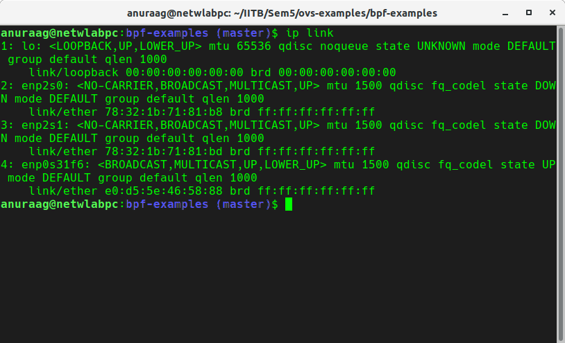

## About
This experiment will help you redirect a packet from one interface to other interface

* List of Interfaces



* `lo` interface is indexed with `1`

Line `50` of bpf.c is:

```
50 bpf_clone_redirect(skb, 1, 0);
```

* All packets from interface `enp0s31f6` will be redirected to `lo`

## STEPS

* `make bpf.o`

* `make qdisc run show exec`

* `make delete qdisc-delete`
