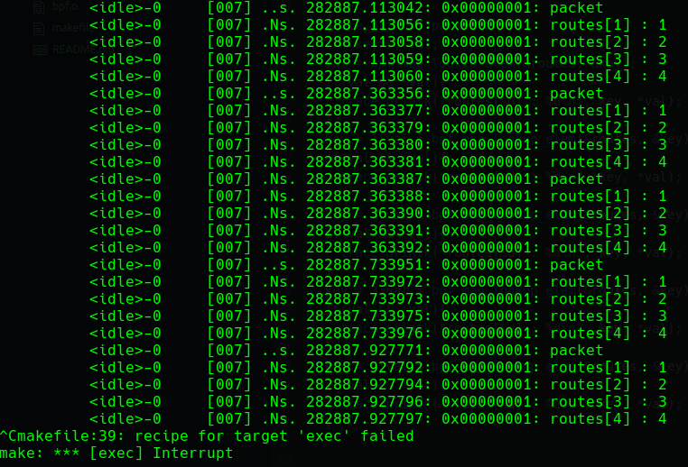
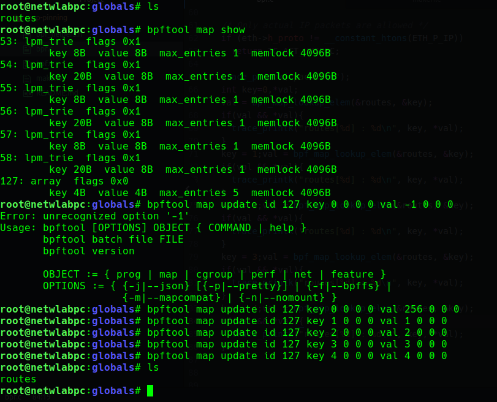

## About
This experiment will help you understand how to create and pin a MAP from
tc attached eBPF code.

We modify the pinned map using `bpftool` and observe the timely update in maps.

## STEPS
* `make bpf.o`

* `make qdisc run show exec`

* `sudo bpftool map show`

> replace `12` with the id of the map created in /sys/fs/bpf/tc/globals/routes

* `sudo bpftool map update id 12 key 0 0 0 0 val -1 0 0 0`

* `sudo bpftool map update id 12 key 1 0 0 0 val 1 0 0 0`

* `sudo bpftool map update id 12 key 2 0 0 0 val 2 0 0 0`

* `sudo bpftool map update id 12 key 3 0 0 0 val 3 0 0 0`

* `sudo bpftool map update id 12 key 4 0 0 0 val 4 0 0 0`

* `make delete qdisc-delete`

* `sudo rm /sys/fs/bpf/tc/globals/routes`
