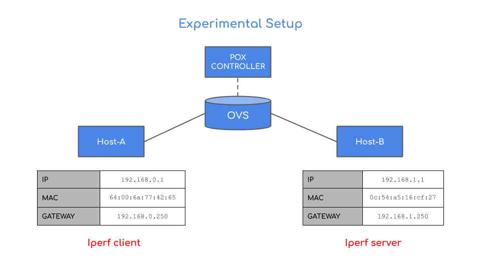
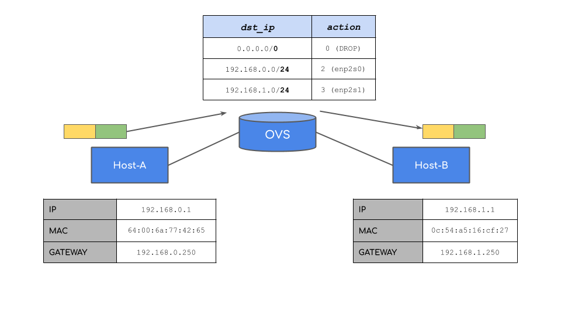
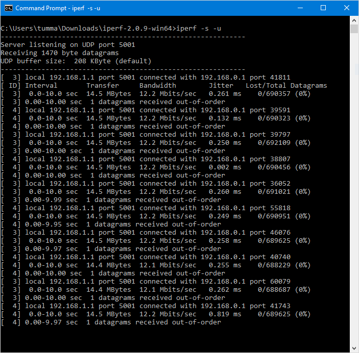

## About

This experiment, will redirect packets based on the destination IP Address, and the corresponding output interface in the map pinned to `/sys/fs/bpf/tc/global/routes`

* Experimental Setup:

* Packet Flow:

* Client side [script](docs/script.sh)

* Server side `iperf` output

> Achieved 12.2 Mbps speed using my experimental setup.
