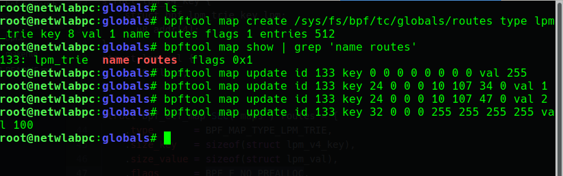
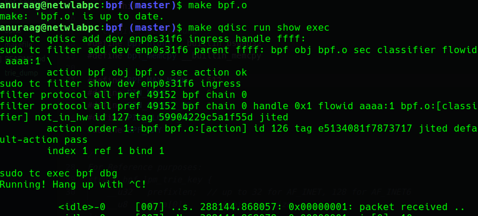
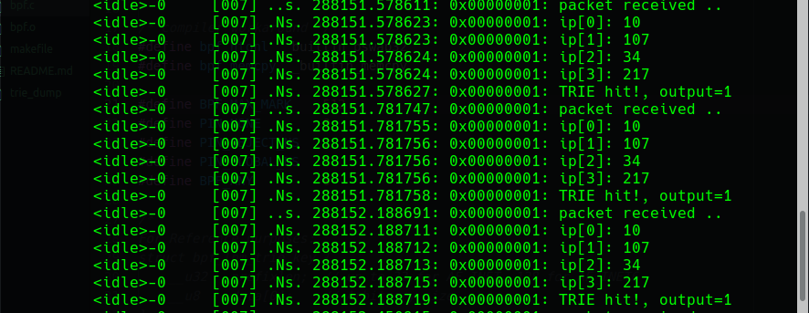
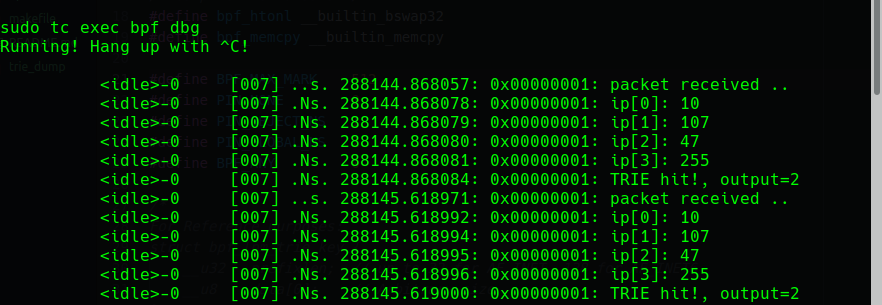
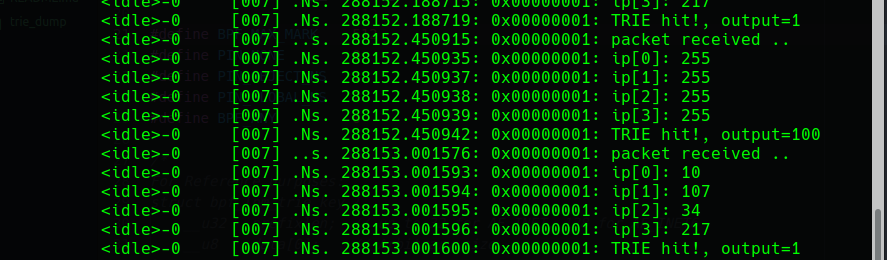
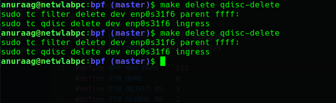

## Details
In this experiment,

* we will create a `BPF_MAP_TYPE_LPM_TRIE` *(LPM_TRIE eBPF Map)*

* store some entries in it from userspace, using `ebpftool`

IP/prefix           |   Output
--------------------|--------------
0.0.0.0/0           |   255
10.107.34.0/24      |   1
10.107.47.0/24      |   2
255.255.255.255/24  |   100

* For each packet arrival on interface `enp0s31f6`, we will output the action number (from the table)

## STEPS

* Create a eBPF MAP using `ebpftool`

```
bpftool map create /sys/fs/bpf/tc/globals/routes type lpm_trie key 8 \
val 1 name routes flags 1 entries 512

bpftool map show | grep 'name routes'

bpftool map update id 133 key 0 0 0 0 0 0 0 0 val 255

bpftool map update id 133 key 24 0 0 0 10 107 34 0 val 1

bpftool map update id 133 key 24 0 0 0 10 107 47 0 val 2

bpftool map update id 133 key 32 0 0 0 255 255 255 255 val 100
```



* Attach eBPF to interface `enp0s31f6` ingress

```
make bpf.o
make qdisc run show exec
```



* Observe the action being printed on the console for each ingress packet.







* Detach eBPF from the interface, once our task is done.

```
make delete qdisc-delete
sudo rm /sys/fs/bpf/tc/globals/routes
```




## Useful Resources:

Following links will be really helpful, for any coding related to eBPF.

* <https://github.com/cilium/cilium/blob/master/bpf/lib/xdp.h>

* <https://github.com/cilium/cilium/blob/master/bpf/bpf_xdp.c>

* <http://man7.org/linux/man-pages/man8/tc-bpf.8.html#top_of_page>

* <https://git.kernel.org/pub/scm/network/iproute2/iproute2.git/tree/examples/bpf/bpf_shared.c>

* <https://askubuntu.com/questions/1134896/ebpf-maps-how-to-update-using-bpftool-from-command-line>
