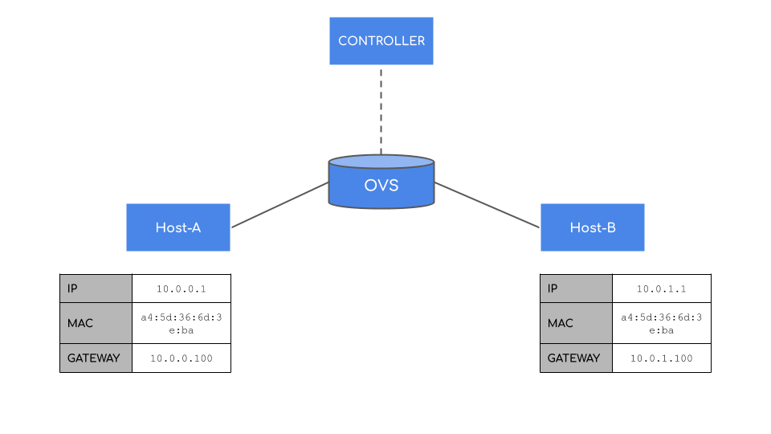
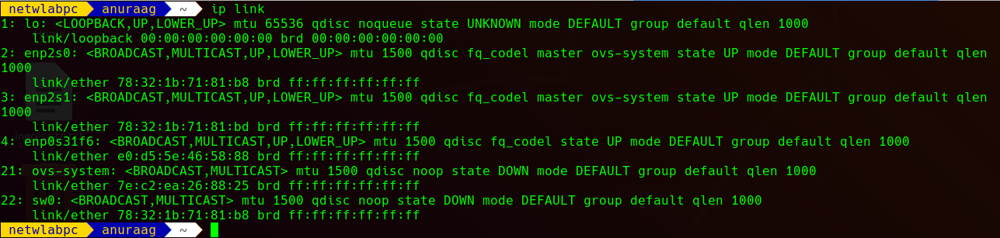
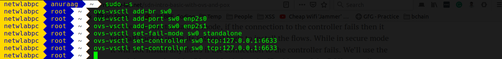
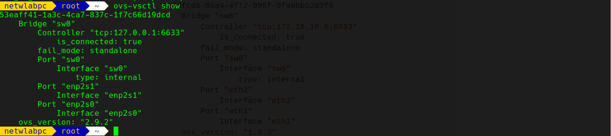
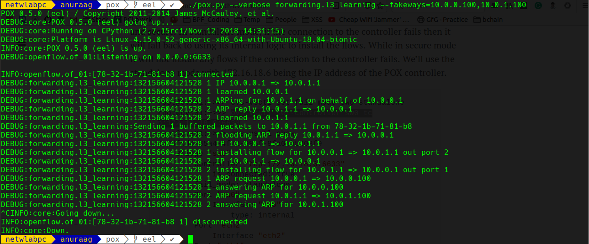

# L3 Learning

## Description
Implementation of L3 Switch using `OVS`(open vswitch) with `POX` as controller.

## Setup

* `ip link` on OVS result:

* OVS setup commands:

* OVS:

* POX controller:

## Requirements

- `POX` controller <https://github.com/noxrepo/pox>

- `openvswitch-switch`, `openvswitch-common`, `openvswitch-doc`

## References

- <https://remote-lab.net/sdn-intro-basic-with-ovs-and-pox>

- <https://noxrepo.github.io/pox-doc/html/#forwarding-l3-learning>
